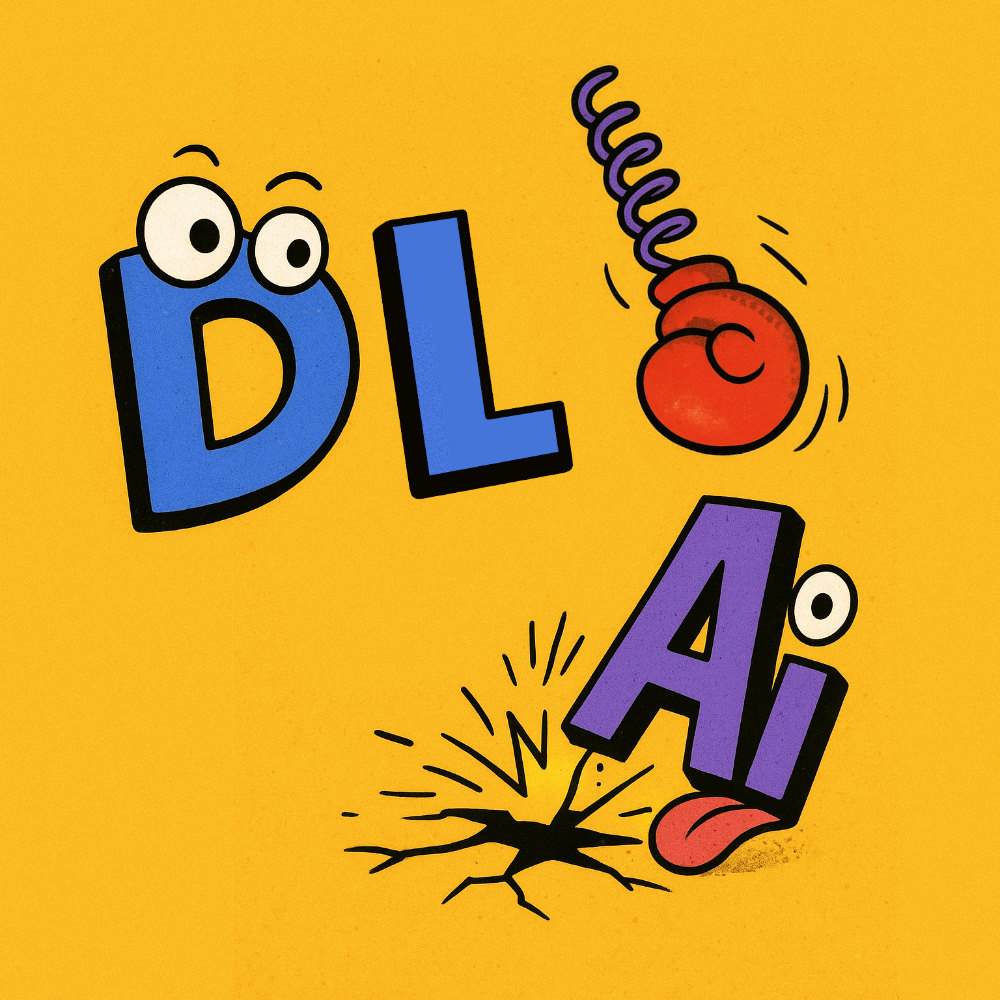

# Курс "Глубинное обучение (ГО) 1 / Введение в ГО" на ФКН ВШЭ

  

## Версии курса прошлых лет

* [2021-2022](https://github.com/xiyori/intro-to-dl-hse/tree/2021-2022)
* [2022-2023](https://github.com/xiyori/intro-to-dl-hse/tree/2022-2023)
* [2023-2024](https://github.com/xiyori/intro-to-dl-hse/tree/2023-2024)
* [2024-2025](https://github.com/xiyori/intro-to-dl-hse/tree/2024-2025)

## Полезные ссылки

* [Вики-страничка](http://wiki.cs.hse.ru/Глубинное_обучение_1_25/26)
* Таблица с оценками
* Плейлист с записями занятий

## Лекции

[Глоссарий](https://github.com/xiyori/intro-to-dl-hse/blob/2025-2026/glossary.md) с терминами.

TBD

## Семинары

TBD

## Маленькие домашние задания

TBD

## Теоретические домашние задания

Теоретические ДЗ не сдаются и предлагаются студентам для самостоятельного решения и ознакомления

TBD
